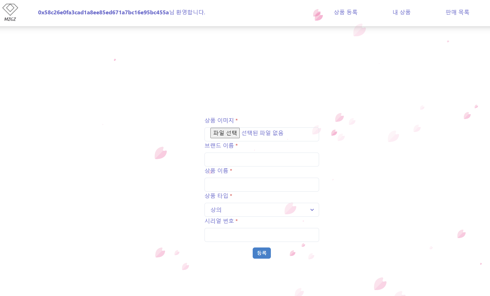
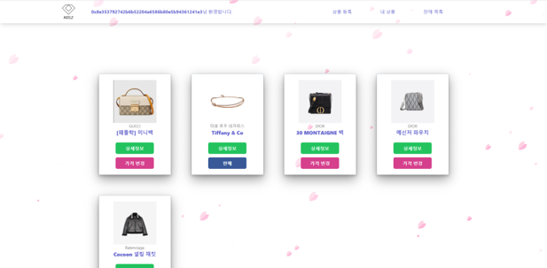
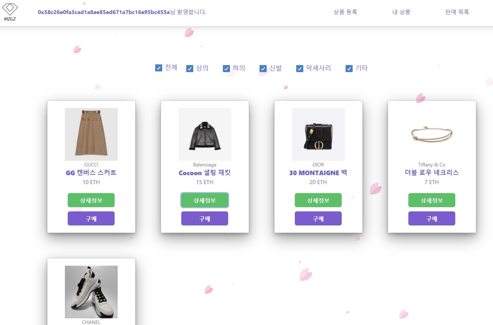
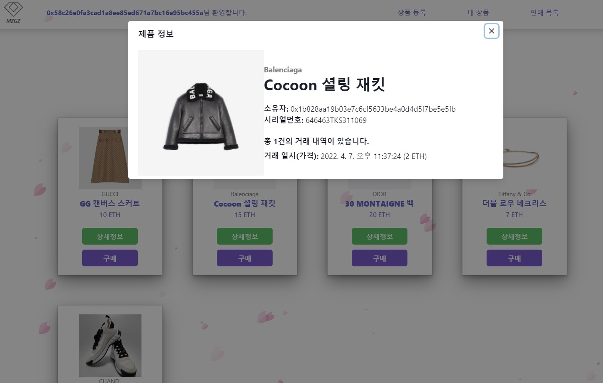

## Overview

## 0. 메타마스크 연결

* 메타 마스크를 이용해 지갑 계정과 연결해야 합니다.
* Ropsten 테스트넷에 연결해야 합니다.

## 1.인트로 화면

* 소개 페이지입니다. 해당 영역을 클릭하면 아래 페이지로 이동합니다.
    * 메타마스크 설치 방법
    * 블록체인 지갑 등록
    * 제품 등록 및 NFT발행

## 2.제품 등록화면

* 해당 페이지에서 제품을 등록할 수 있습니다.

## 3.내 상품

* 2번에서 등록한 상품을 내 상품에서 확인할 수 있습니다.

## 4. 전체 판매 목록

* 다른 사람들이 판매하고 있는 판매 목록을 확인할 수 있습니다.

## 4-1). 상세정보 클릭

* 제품에 대한 상세정보를 볼 수 있습니다.
