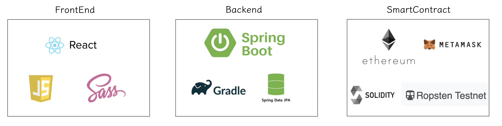
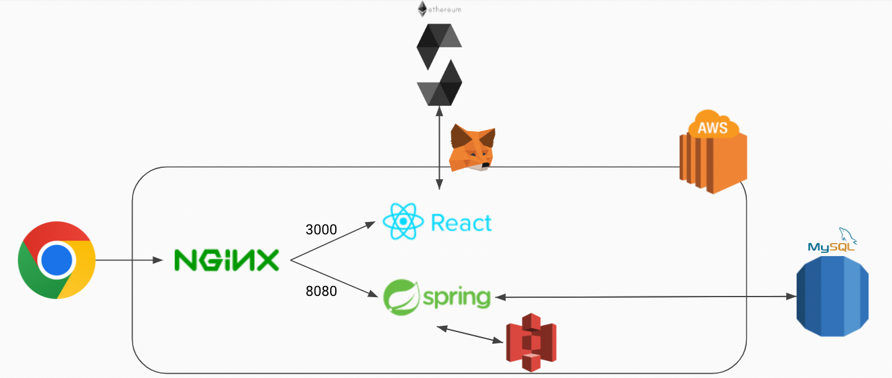

## 명진가 z

## dependency



## architecture



## smart contract 

* solidity ^0.8.0

## frontend - react

```
cd frontend
npm install
npm run start
```

* package.json dependency

```
"@chakra-ui/react": "^1.8.6",
"@emotion/react": "^11.8.1",
"@emotion/styled": "^11.8.1",
"@testing-library/jest-dom": "^5.16.2",
"@testing-library/react": "^12.1.4",
"@testing-library/user-event": "^13.5.0",
"axios": "^0.26.1",
"framer-motion": "^6.2.8",
"moment": "^2.29.1",
"react": "^17.0.2",
"react-app-rewired": "^2.2.1",
"react-datetime": "^3.1.1",
"react-dom": "^17.0.2",
"react-loading": "^2.0.3",
"react-router-dom": "^6.2.2",
"react-scripts": "^4.0.3",
"react-tsparticles": "^1.43.0",
"styled-components": "^5.3.5",
"web-vitals": "^2.1.4",
"web3": "^1.7.1",
"web3-utils": "^1.7.1"
```

### backend - spring

* java
    * java 11

* spring version
    * id 'org.springframework.boot' version '2.6.4'

* gradle dependency
```
developmentOnly 'org.springframework.boot:spring-boot-devtools'
implementation 'org.springframework.boot:spring-boot-starter-data-jpa'
implementation 'org.springframework.boot:spring-boot-starter-web'
implementation group: 'org.springframework.cloud', name: 'spring-cloud-starter-aws', version: '2.2.1.RELEASE'
compileOnly 'org.projectlombok:lombok'
runtimeOnly 'mysql:mysql-connector-java'
annotationProcessor 'org.projectlombok:lombok'
testImplementation 'org.springframework.boot:spring-boot-starter-test'
```

* 실행

```
cd backend
./gradlew build
java -jar [snapshot.jar]
```
